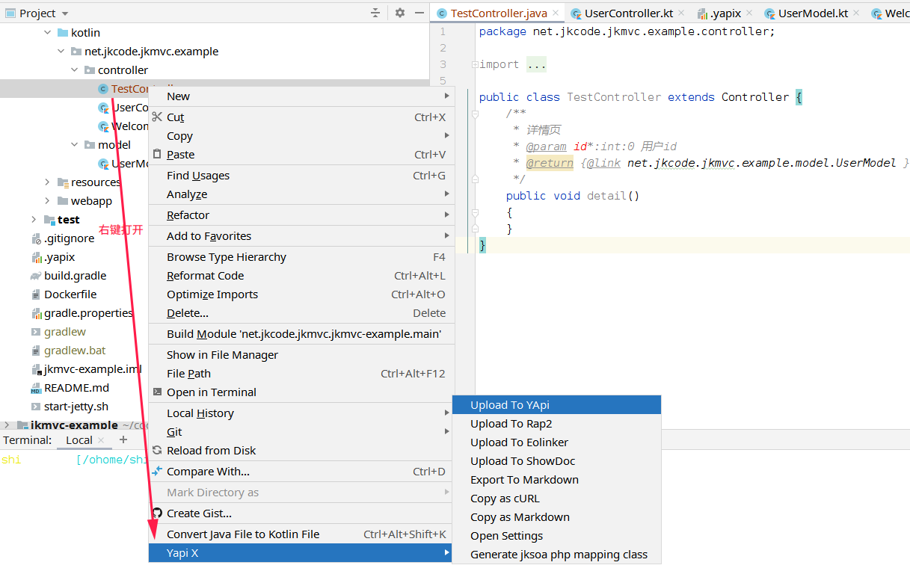
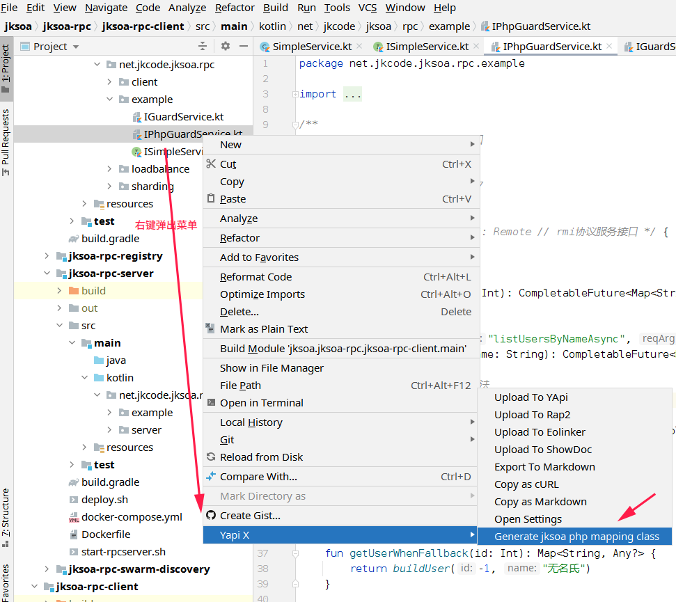
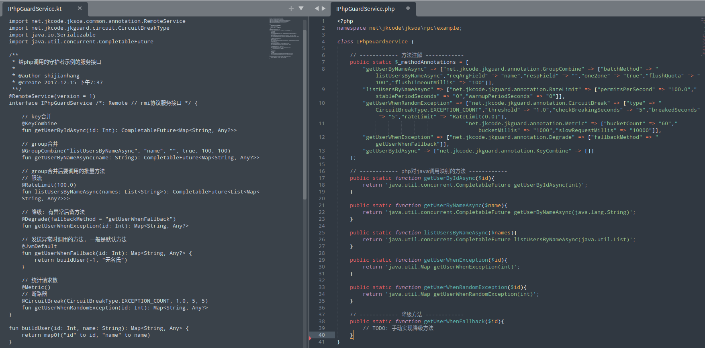

# jk-yapix 改造文档
> 先向yapix作者致谢，本插件是基于[yapix](https://github.com/jetplugins/yapix) 重构与改造，支持以下新的特性

**1 支持解析kotlin代码**

**2 支持导出jkmvc框架的api接口**

从jkmvc框架的controller类的javadoc中导出api接口信息:
1. 请求参数格式为 `@param 参数名*:类型=默认值`，其中`*`表示必填
2. 返回值（响应）格式为`@return [类名]`，响应数据结构优先取方法注释中`@return`链接的类，如果没有再取方法返回值类型;

例子：参考[UserController.kt](https://github.com/shigebeyond/jkmvc-example/blob/master/src/main/kotlin/net/jkcode/jkmvc/example/controller/UserController.kt)
```kotlin
/**
 * 详情页
 * @param id:int=0 用户id
 * @return [UserModel]
 */
public fun detail()
```

有以下限制：
1. 写死post方法
2. 不支持json提交，只支持form提交

使用


**3 支持根据jksoa框架中的java服务接口来生成php映射类**
使用


java服务类 vs 生成的php映射类

**4 支持类短名, 即省略包名**

适用于于以下3种类: 
1. import的类
2. 当前包的类
3. java.util包的类

**5 重构优化**
1. 抽象`IApiParser`类族，方便支持其他web框架的api提取
2. 抽象`IPsiDocCommentHelper`类族，统一与兼容java/kotlin的注释解析
3. 优化`PsiLinkUtils`, 支持根据类短名来获得psi类，方便类引用
4. 优化类型解析:`KernelParser#doParseType()` 先过滤原始类型，以便减少无用的类型查找来优化性能 + 支持string类简写

# 原框架 Yapi X 文档
> 本项目已收录到[YApi](https://github.com/YMFE/yapi), [Rap2](https://github.com/thx/rap2-delos) 官方仓库

**一键生成API接口文档, 上传到YApi, Rap2, Eolinker等平台的IDEA插件.**

**亮点**
- 零成本、零入侵： 编写标准Javadoc即可，无需依赖swagger注解, 生成文档准确性高达99%。
- 开箱即用、智能mock规则: 几乎零配置直接可生成文档，也支持复杂配置满足你95%的场景。
- 多平台支持：支持YApi, Rap2, Eolinker等，并支持账户密码登录。

**特性**
- [x] 一键从源代码生成api文档
- [x] 上传到YApi平台
- [x] 上传到Rap2平台
- [x] 上传到Eolinker平台
- [x] 上传到ShowDoc平台
- [x] 导出markdown文件
- [x] 复制为cURL命令


## 使用
1. 安装: 打开Idea -> File -> Settings -> Plugins, 搜索: Yapi X
2. 配置: 项目根目录创建".yapix"文件, 内容: yapiProjectId=110
3. 上传: 光标放置在你的控制类或方法，右键执行: Upload To YApi ( 提示：如果未填登录信息，会弹窗提示 )

更多：[十分钟使用指南](docs/GUIDE.md)

## 交流
欢迎提出您的发现问题、需求、建议、以及提交代码来参与贡献。
- QQ交流群：860701800

提示：如果您准备为该插件开发一个新功能，请先通过issues讨论，避免重复开发。

## 捐赠
非常感谢您使用Yapi X，如果贵公司有非通用的定制开发需求，可提供有偿定制开发服务。
